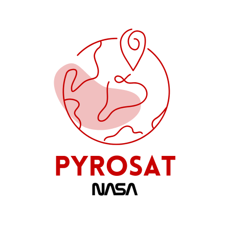

# PyroSat 🔥🛰️  

PyroSat is a **wildfire tracking application** built with **React** and powered by **NASA’s EONET API**.  
It provides an **interactive world map** that displays **active wildfire events in real-time**, offering a simple and intuitive way to visualize ongoing fire activity across the globe.  

  

  

---

## 🚀 Features  

- **Wildfire Event Tracking**  
  - Real-time data from NASA EONET.  
  - Displays active fire locations worldwide.  

- **Interactive Map**  
  - Google Maps integration with fire location markers.  
  - Zoom & pan to explore affected areas.  

- **Event Details**  
  - Click markers to see fire information (title, coordinates).  

- **Minimal UI**  
  - Clean, lightweight design focused on clarity.  

---

## 🖥️ Tech Stack  

- **Frontend:** React (JavaScript), HTML, CSS  
- **Maps:** Google Maps API  
- **Data Source:** NASA EONET API  
- **Icons:** Iconify  

---

## 🎬 Live Demo  

Check out PyroSat in action:  

🎥 [Live Demo Video](https://youtu.be/2H3iaNIwPcE) 

---

© 2025 **PyroSat** | Built by Tidjani. All rights reserved.  
